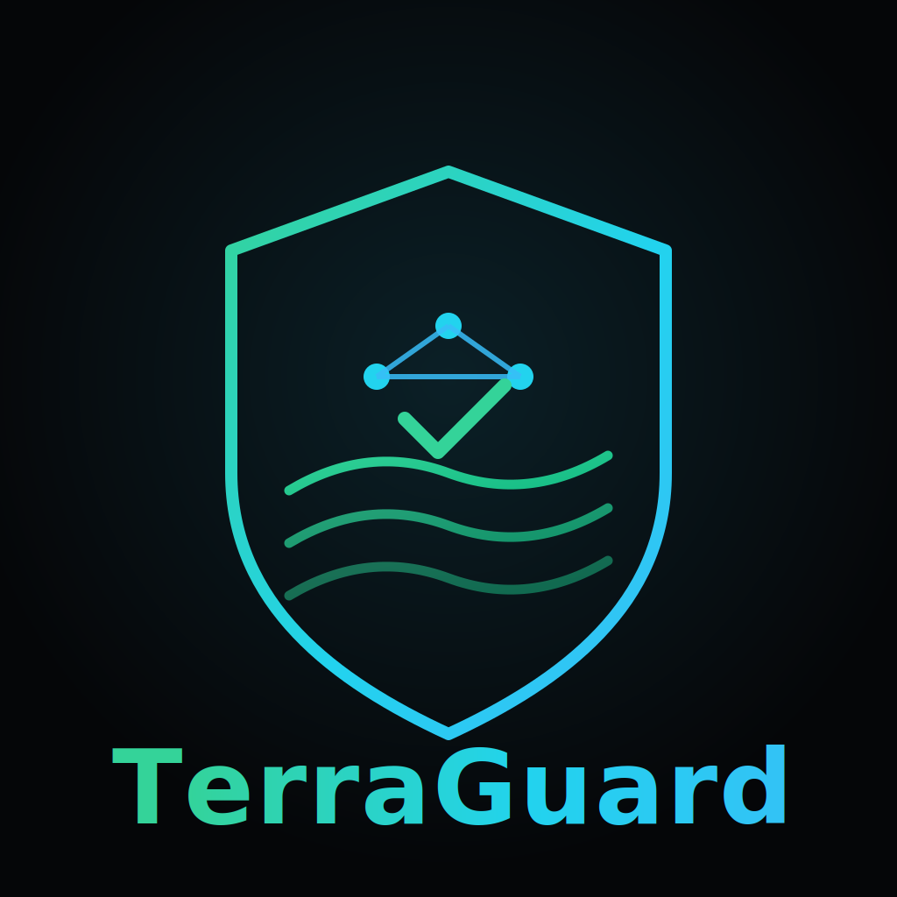

# TerraGuard 🛡️

*An AI-assisted reviewer for Terraform Infrastructure-as-Code.*



TerraGuard reads your Terraform configurations and flags security risks, best-practice violations, and maintainability problems before they reach production. It pairs large-language-model reasoning (Google Gemini) with a code-specialized classifier (CodeBERT) and a deterministic rule engine, then surfaces everything through an interactive Streamlit dashboard so you can compare what each approach found.

Think of it as a second reviewer for your `.tf` files — one that never gets tired of checking the same patterns and explains its reasoning in plain language.

---

## The idea in one line

Static rules catch the *known* mistakes; an LLM catches the *contextual* ones; a code model gives a fast file-level verdict. TerraGuard runs all three and shows you where they agree and where they don't.

---

## How analysis works

When you analyze a Terraform file, it passes through several independent checks whose results are then collected into a single report:

- **LLM review (Gemini).** The configuration is sent to Google Gemini with a focused prompt asking it to find issues. It returns structured JSON — each finding tagged with a type, a line number, and a human-readable explanation. This is the layer that catches context-dependent problems a fixed rule would miss.
- **Code classification (CodeBERT).** Microsoft's CodeBERT, a BERT-family model trained on source code, gives the file a high-level label — `None`, `Best Practice`, or `Security Risk`. It's a fast, model-driven sanity check on the file as a whole.
- **Rule engine.** A set of deterministic checks looks for specific, well-understood anti-patterns — for example, an S3 bucket exposed via a `public-read` ACL, or an EC2 instance that breaks naming conventions. No model involved; just reliable pattern matching.
- **Report assembly.** Findings from each source are written out as both machine-readable JSON and a human-readable Markdown report, complete with metadata like timestamps, filenames, and issue counts.

Under the hood, a Terraform parser (built on the HCL2 library) first breaks each file into its structured blocks — resources, variables, providers, and so on — so every layer is working from clean, parsed input rather than raw text.

---

## What you get

- **Side-by-side model comparison** — see Gemini's detailed findings next to CodeBERT's file-level verdict.
- **Ask-about-your-results** — a chat-style panel for questioning the issues that were detected.
- **Upload and analyze** — drop a `.tf` file into the web UI for an immediate review.
- **Visual summaries** — Matplotlib charts break down findings at a glance.
- **Dual output formats** — structured JSON for tooling, Markdown for humans.

---

## Project layout

```
terraguard/
├── analyzer/                  # Core analysis modules
│   ├── ai_suggester.py        # Gemini integration
│   ├── codebert_analyzer.py   # CodeBERT classification
│   ├── terraform_parser.py    # HCL/HCL2 parsing
│   ├── rule_engine.py         # Deterministic rule checks
│   └── output_writer.py       # JSON + Markdown report writer
├── app.py                     # Streamlit web interface
├── run_analysis.py            # End-to-end analysis pipeline
├── examples/
│   └── main.tf                # Sample Terraform to try it on
├── outputs/                   # Generated reports
│   ├── gpt4_main_tf.json
│   ├── codebert_main_tf.json
│   └── comparison_report.md
├── assets/                    # UI assets (logo, etc.)
├── tests/                     # Test suite
├── requirements.txt
└── README.md
```

---

## Getting started

### Prerequisites

- Python 3.8+
- pip
- A Google Gemini API key (for the LLM layer) — available from [Google AI Studio](https://aistudio.google.com/app/apikey)

### Install

```bash
git clone https://github.com/<your-username>/terraguard.git
cd terraguard
pip install -r requirements.txt
```

### Configure your API key

Copy the example environment file and add your key — never hard-code it or commit it:

```bash
cp env.example .env
# then edit .env:
# GEMINI_API_KEY=your_api_key_here
```

> **A note on the SDK.** TerraGuard uses Google's current **`google-genai`** SDK rather than the older `google-generativeai` package. Both reach the same Gemini models, but `google-generativeai` is now deprecated — it no longer receives updates and will eventually lose support — whereas `google-genai` is the actively maintained, future-proof client Google recommends going forward.

### Run it

Run the full pipeline against the bundled example:

```bash
python run_analysis.py
```

Or launch the dashboard and work interactively:

```bash
streamlit run app.py
# open http://localhost:8501
```

To check your own infrastructure, upload a `.tf` file through the dashboard, or point `run_analysis.py` at your file.

---

## What the output looks like

Gemini returns issue-level detail:

```json
{
  "issues_detected": [
    {
      "type": "Security Risk",
      "line": 8,
      "message": "S3 bucket uses a public-read ACL, which can expose its contents publicly."
    },
    {
      "type": "Best Practice",
      "line": 17,
      "message": "Hard-coded AMI ID may break if the image is later deregistered."
    }
  ]
}
```

CodeBERT returns a file-level classification:

```json
{
  "issues_detected": [
    {
      "type": "None",
      "line": "N/A",
      "message": "CodeBERT classified the file as 'None'."
    }
  ]
}
```

---

## A note on secrets

Keep your Gemini key in a local `.env` file (the repo ships with `env.example` as a template) and make sure `.env` stays in `.gitignore`. For anything beyond local development, reach for a managed secret store such as AWS Secrets Manager or Azure Key Vault, and rotate keys periodically. Committing credentials to version control is the single most common — and most avoidable — mistake here.

---

## Who it's for

- **DevOps engineers** — a pre-deploy gut-check on Terraform changes, and a way to learn IaC conventions by example.
- **Security teams** — automated surfacing of risky patterns and a starting point for compliance review.
- **Developers** — catch problems early and keep infrastructure code consistent across a team.

---

## Where it could go next

- Whole-module analysis across multiple files rather than one at a time
- User-defined custom rules
- A REST API for slotting into CI/CD pipelines
- Cost-optimization suggestions
- Mapping findings to compliance frameworks like CIS or NIST
- Fine-tuning CodeBERT specifically for Terraform, plus result caching and batch runs

---

## Background & credits

This project began as **CloudSage**, a collaborative build. The original codebase and its MIT license are authored by **Subramanian Raj Narayanan** (see the [LICENSE](LICENSE) file), and that notice is preserved here in full.

**Contributors:**
- Apoorva Kumar
- Eshan Jain

If you're forking or building on this, please keep the existing license and attribution intact.

### Thanks to

Google (Gemini), Microsoft (CodeBERT), HashiCorp (Terraform/HCL), Streamlit, and Hugging Face Transformers — the tools this project is built on.

---

## License

Released under the MIT License. The full text, including the original copyright notice, is in the [LICENSE](LICENSE) file.
